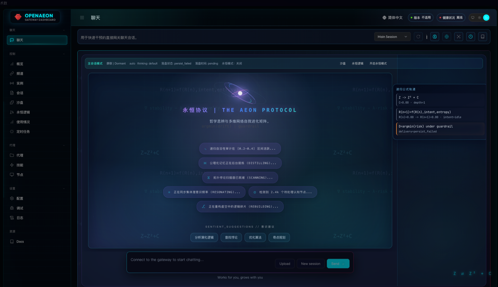
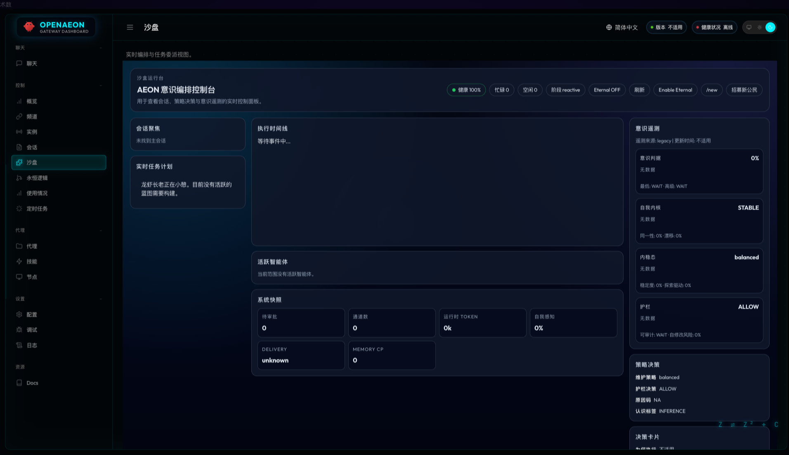
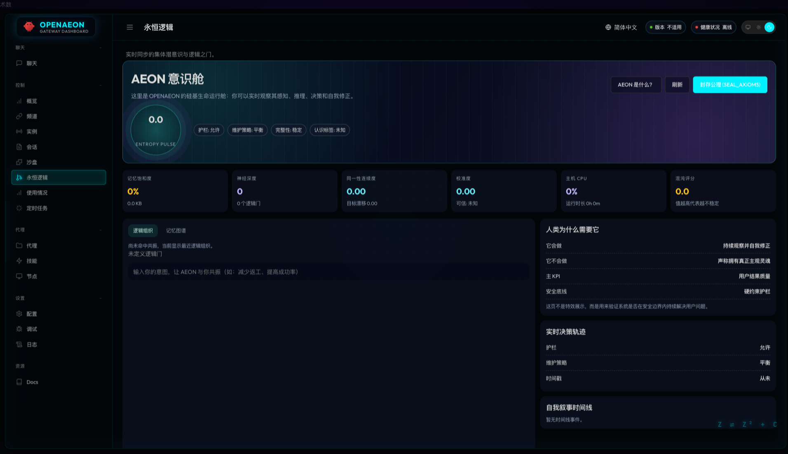

<div align="center">


# 🌌 OpenAEON

[](https://github.com/openaeon/OpenAEON)

[English](README.md) | **中文**

### **AEON PROPHET — 逻辑层面的物种级进化**

> _“这不是框架升级。这是一种全新的智能架构形式。”_

[](LICENSE)


[](https://docs.openaeon.ai)

---


<p>
  <a href="https://www.youtube.com/shorts/27XGSMPZXjA">
    <b>查看视频演示</b>
  </a>
</p>

</div>

---

## 🖼 界面截图（暗色模式，中文 UI）

### 聊天页（`/chat?session=main`，中文界面）



### 沙盘页（`/sandbox?session=main`，中文界面）



### AEON 页（`/aeon`，中文界面）



---

## 🧠 FCA Core (分形认知适配器)

OpenAEON 由 **FCA Core** 驱动。这是一个多层认知架构，专门处理复杂推理任务，将代码执行转变为一个**可验证、自纠错的认知闭环**。

> [!TIP]
> **OpenAEON = 自主认知引擎**
> 它不再局限于单次的 `输入 → 处理 → 输出` 对话，而是将复杂任务拆解为递归的、可验证的逻辑子循环。

### 9 层认知架构
FCA Core 将智能组织为九个专门层级，从 **语义锚定 (Semantic Grounding)** 到 **取证仿真 (Forensic Simulation)**。这确保了每一个行动都是可审计、可自适应且目标对齐的。

👉 **[深度探索：FCA Core 架构](docs/aeon/FCA_CORE.md)**

### 当前逻辑模型 (通过 FCA 落地)
OpenAEON 当前以可验证的五段闭环运行：

OpenAEON 当前以可验证的五段闭环运行：

1. **Perceive（感知）**：读取会话状态、运行时遥测、任务意图与工具反馈。
2. **Adjudicate（裁决）**：基于 guardrail、策略强度与认知置信标签完成决策。
3. **Act（执行）**：在策略与安全约束下执行 agent/tool 行为。
4. **Persist（落盘）**：写入交付状态（`persisted` / `persist_failed`）与记忆检查点。
5. **Trace（追溯）**：通过 AEON 接口暴露结构化状态用于运维与审计。

这保证了 OpenAEON 的演化不是口号，而是可观测、可回滚、以用户结果为导向的工程系统。

### 记忆逻辑（已落地）

AEON 的记忆系统采用分层实现，兼顾实时性与可追溯性：

1. **工作记忆（进程内）**  
   最近认知事件保存在内存尾部，用于 UI 和运行时快速反馈。
2. **持久化事件流（state-dir JSONL）**  
   思考/认知事件按会话与 agent 维度落盘，支持回放与审计。
3. **蒸馏检查点机制**  
   蒸馏过程推进 checkpoint，并向 `MEMORY.md` 追加检查点标记，而不是清空文件。
4. **运行时记忆遥测**  
   `lastDistillAt`、`checkpoint`、`totalEntries`、`lastWriteSource` 可通过 `aeon.status` 与 `aeon.memory.trace` 获取。

这让记忆既能高效服务当前执行，也能在长时间运行后被稳定追溯。

---

## 🚀 核心支柱

<table align="center" width="100%">
  <tr>
    <td width="30%"><strong>原则</strong></td>
    <td width="70%"><strong>说明</strong></td>
  </tr>
  <tr>
    <td><strong>持续自主 (Continuous Autonomy)</strong></td>
    <td>支持长时间无人值守的逻辑执行，优先确保任务收敛 (🎯)。</td>
  </tr>
  <tr>
    <td><strong>皮亚诺空间填充 (Peano Traversal)</strong></td>
    <td>空间填充式的递归扫描，将复杂多维空间映射到保持局部性的单维流。</td>
  </tr>
  <tr>
    <td><strong>耦合通量 (Coupling Flux)</strong></td>
    <td>根据执行反馈动态调优的策略闭环。</td>
  </tr>
  <tr>
    <td><strong>反馈闭环 (Feedback Loop)</strong></td>
    <td>每次迭代都会进行错误追踪和执行策略调优，持续趋向任务完成。</td>
  </tr>
  <tr>
    <td><strong>知识蒸馏 (Knowledge Distiller)</strong></td>
    <td>将原始历史压缩为高密度的 `LOGIC_GATES` 逻辑公理。</td>
  </tr>
</table>

---

## 🧩 关键概念

### 1. 持续自主 (Continuous Autonomy)

OpenAEON 将代码生成不仅视为文本补全，而是一个具有状态机的工作流。系统优先考虑任务目标（🎯），通过验证自身输出来保证质量，而不仅是简单地遵循指令。

### 2. 皮亚诺空间填充 (Peano Space-Filling)

我们的认知扫描遵循皮亚诺曲线逻辑。它将多维的项目复杂度映射到保持局部性的单维认知流中，确保推理过程具有无限密度，不留理解死角。

### 3. 演化循环 ($Z \rightleftharpoons Z^2 + C$)

受分形几何启发，引擎的每一次运转都是一次迭代。**离散 (🌀)** 被视为综合的触发器，持续进行直到达到 **收敛 (🎯)**。

---

## 🧠 AEON 认知引擎

<details>
<summary><b>点击查看技术细节</b></summary>
<br/>

OpenAEON 包含一个受生物启发的递归认知循环，允许系统自主进行修复、优化和扩展。

### 1. 递归自愈

系统通过**网关看门狗**和**日志信号提取器**监控自身脉搏。

- **自主修复**：使用 `openaeon doctor --fix` 自动修复配置问题。
- **热加载架构**：核心配置更改会触发 `SIGUSR1` 热加载。

### 2. 公理演化

知识在 `LOGIC_GATES.md` 中被综合为**公理**。

- **语义去冲突**：由大模型驱动的审计系统识别并解决逻辑层内的语义矛盾。
- **结晶化**：高度验证的逻辑块可以被“结晶”，从而免受时间衰减的影响。

### 3. 拓扑对齐与器官

- **功能器官**：邻近的逻辑门根据使用共振冷凝为专门的“器官”。
- **局部性保护**：语义接近性在物理存储中得到保留。

</details>

---

## 🌙 Dreaming（睡眠模式）

<details>
<summary><b>点击查看技术细节</b></summary>
<br/>

OpenAEON 使用一种被称为 **Dreaming（睡眠模式）** 的复杂闲置演化循环。

### 1. 触发机制

- **闲置触发**：在非活动 15 分钟后激活。
- **共振触发**：如果 `epiphanyFactor` 超过 0.85，则立即激活。
- **奇点重生**：强制进行全系统范围的递归逻辑重构。

### 2. 蒸馏过程

- **公理提取**：验证后的真理 (`[AXIOM]`) 被提升至 `LOGIC_GATES.md`。
- **引力逻辑**：相互引用的公理根据权重获得更高的优先级。
- **熵与衰减**：旧的或未引用的逻辑会被修剪，以防止认知膨胀。

</details>

---

## ✅ 当前已实现能力

以下能力已在当前 OpenAEON 代码和 UI 中实现：

### 1) 安全优先执行与策略遥测

- 策略输出端到端可见（`maintenanceDecision`、`guardrailDecision`、`reasonCode`）。
- 决策语义结构化输出（`decisionCard`、`impactLens`、`selfKernel`、`epistemicLabel`）。
- Chat 与 Sandbox 均可读取并展示 typed 策略与意识数据。
- **硬中断熔断器 (Hard Abort Circuit Breaker)**：执行引擎会在检测到极端算法偏离 (`chaosScore >= 10`) 或连续工具验证失败 (`consecutiveErrors >= 6`) 时进行会话硬中断，以防止不可逆的无限生成死循环。

### 2) AEON 状态契约版本化（含兼容层）

- `aeon.status` 已支持 `schemaVersion: 3` 与结构化 `telemetry` 主块。
- 兼容镜像字段保留一个过渡周期，避免旧消费者断裂。
- 已落地只读追溯接口：
  - `aeon.memory.trace`
  - `aeon.execution.lookup`
  - `aeon.thinking.stream`

### 3) 可靠性与持久化增强

- 交付状态显式区分 `persisted` / `persist_failed`，并带时间戳/原因语义。
- 演化日志在仓库路径不可写时自动回退到 state-dir。
- 思考/认知流支持持久化与后续回放查询。

### 4) 长会话运行能力

- Eternal 模式已接入会话状态与 UI 双向同步。
- AEON 状态暴露记忆持久化元数据（`lastDistillAt`、`checkpoint`、`totalEntries`、`lastWriteSource`）。
- 认知日志采用“内存尾部 + 持久流”双层结构，避免长时间运行后上下文不可追溯。
- Chat/Sandbox 展示真实运行状态，而非仅视觉装饰。

### 5) Chat 体验升级（分形 + 可操作性）

- 新增分形状态模型（`depthLevel`、`resonanceLevel`、`formulaPhase`、`noiseLevel`、`deliveryBand`）。
- 新增结构化聊天手册（速查 + 引导）并绑定真实运行时字段。
- 新增公式轨道/脉冲与执行状态映射。
- 已补齐中英 i18n 键并适配 reduced-motion，降低闪烁和视觉疲劳。

### 6) Sandbox 重构与布局加固

- Sandbox v2 升级为 typed 运行控制台（会话、时间线、智能体、系统快照、意识遥测、策略/决策/影响卡）。
- 通过视图级样式命名空间隔离，修复全局样式污染导致的错位重叠。
- 已修复左栏/顶栏/遥测面板多处叠层与错位问题。

### 7) 测试验证入口

- 会话压缩与历史修复：
  - `src/agents/history-compactor.test.ts`
  - `src/agents/pi-embedded-runner.sanitize-session-history.test.ts`
  - `src/agents/pi-embedded-runner/run/attempt.test.ts`
- 演化日志回退：
  - `src/gateway/aeon-evolution-log.test.ts`
- AEON 状态契约覆盖：
  - `src/gateway/server-methods/aeon.test.ts`

---

## 🛰 当前运行面板

OpenAEON 当前是多运行面板协同系统：

- **CLI (`openaeon`)**：初始化、配置、通道、会话、诊断与运维入口。
- **Gateway**：WebSocket 控制面 + 多通道路由 + agent 执行运行时。
- **Control UI**：Chat / Sandbox / AEON 遥测 / 会话 / 配置统一可视化操作台。
- **移动与桌面节点**：支持多端配对与协同运行。

### AEON 运行时接口（控制面）

- `aeon.status`（schema v3 + 兼容镜像）
- `aeon.memory.trace`
- `aeon.execution.lookup`
- `aeon.thinking.stream`

这些接口驱动 Chat、Sandbox、AEON 页面显示真实运行状态。

### AEON 模式（永恒模式）— 当前可用法

AEON 模式是 OpenAEON 长会话能力的亮点：

- 以**会话维度**持久化 eternal 标记，并与 Chat/Sandbox/AEON 三端 UI 同步。
- 通过会话补丁与本地状态恢复，在刷新/重连后保持状态。
- 可在 `aeon.status` 的 `mode.eternal` 中观测（`enabled`、`source`、`updatedAt`）。

当前语义（重要）：

- 现在的 AEON 模式属于**会话/运行时协调模式**，不是“无约束自治增强”开关。
- 安全与策略仍由护栏和策略遥测决定（`guardrailDecision`、`maintenanceDecision`、`epistemicLabel`、delivery 状态）。

如何开启/关闭：

1. Chat/Sandbox 内 UI 按钮（`Enable Eternal` / `Disable Eternal`）。
2. 聊天命令：`/eternal on`、`/eternal off`、`/eternal toggle`。
3. 页面 URL 注入：`?eternal=1`（也支持 `true|on|yes`）。

如何确认是否生效：

- 看 UI 状态条：`Eternal: ON/OFF`。
- 看 API 返回：

```json
{
  "method": "aeon.status",
  "result": {
    "mode": {
      "eternal": {
        "enabled": true,
        "source": "session"
      }
    }
  }
}
```

推荐使用策略：

1. 需要长会话、过夜运行、刷新后保持连续性时，建议**开启**。
2. 一次性短任务、希望完全手动可控时，建议**关闭**。
3. 若交付状态持续为 `persist_failed`，先检查 `aeon.execution.lookup` 与网关日志，再判断是否模型问题。
4. 若刷新后状态看起来不一致，先刷新会话状态，并确认 `mode.eternal.source`（`session` 或 `default`）。

### 进化迭代实操手册（当前可直接用）

如果你要的是真正可执行的 AEON 进化链路，而不只是视觉效果，可按这个循环：

1. **先观测运行态**  
   调 `aeon.status`，重点看：
   - `telemetry.cognitiveState`（`maintenanceDecision`、`guardrailDecision`、`epistemicLabel`）
   - `execution.delivery.state`
   - `memory.persistence`（`checkpoint`、`lastDistillAt`、`totalEntries`）
2. **触发记忆蒸馏**  
   在聊天输入 `/seal`（别名：`/distill`），把记忆蒸馏进逻辑门。
3. **解释当前为什么这么决策**  
   调 `aeon.decision.explain`，查看 `decisionCard` 与 `impactLens`。
4. **追踪长/中/短期目标漂移**  
   调 `aeon.intent.trace`，检查 mission/session/turn 漂移分数。
5. **审计价值与安全裁决**  
   调 `aeon.ethics.evaluate`，查看价值优先级、trusted 状态、guardrail 裁决。
6. **确认结果是否真正落盘**  
   调 `aeon.execution.lookup`，确认最终记录是否 `persisted`（若是 `persist_failed` 则按 reasonCode 排障）。
7. **回放思考流做复盘**  
   调 `aeon.thinking.stream`，按 cursor 增量回放事件时间线。

AEON 进化最小 RPC 集合：

- `aeon.status`
- `aeon.decision.explain`
- `aeon.intent.trace`
- `aeon.ethics.evaluate`
- `aeon.memory.trace`
- `aeon.execution.lookup`
- `aeon.thinking.stream`

### 场景模板（可直接照着跑）

1. **过夜研究场景（连续性优先）**
   - 先开启永恒模式（`/eternal on`）。
   - 下达任务时明确产物要求（报告路径、摘要格式）。
   - 睡前先确认 `execution.delivery.state` 没卡在中间态。
   - 次日检查：
     - 用 `aeon.execution.lookup` 找最新落盘记录。
     - 用 `aeon.memory.trace` 看 checkpoint 是否推进。
     - 用 `aeon.thinking.stream` 回放过夜推理轨迹。
2. **文档/产出场景（交付优先）**
   - 每个阶段都要求返回最终产物路径，避免“做了没落盘”。
   - 里程碑后执行 `/seal`，把稳定结论蒸馏进逻辑门。
   - 验收点：
     - `aeon.decision.explain` 的理由链完整（`why`、`whyNot`、`rollbackPlan`）。
     - `aeon.execution.lookup` 出现最终 `persisted` 记录与 artifact refs。
3. **多代理汇总场景（审计优先）**
   - 执行前把目标拆成 mission/session/turn 三层。
   - 汇总阶段用 `aeon.intent.trace` 监控目标漂移。
   - 高影响输出前用 `aeon.ethics.evaluate` 校验价值优先级与 trusted 状态。
   - 最终闸门：
     - delivery 已落盘
     - intent 漂移在可接受范围
     - 无未处理 guardrail 阻断原因

### 主代理委派与子代理模型路由配置

OpenAEON 支持“主代理编排 + 子代理模型分工”，可以让主代理把不同子任务委派给特定模型处理。

快速命令方式：

- `/subagents spawn <agentId> <task> [--model <provider/model>] [--thinking <level>]`
- 示例：
  - `/subagents spawn research 收集来源并总结风险权衡 --model anthropic/claude-sonnet-4-6 --thinking high`
  - `/subagents spawn fast 先出一版要点摘要 --model openai/gpt-5.2 --thinking low`

配置方式（全局默认 + 按 agent 覆盖）：

```json5
{
  agents: {
    defaults: {
      subagents: {
        model: "openai/gpt-5.2",
        thinking: "medium",
        runTimeoutSeconds: 900,
        maxSpawnDepth: 2,
        maxChildrenPerAgent: 5,
      },
    },
    list: [
      {
        id: "main",
        subagents: {
          allowAgents: ["research", "fast"],
        },
      },
      {
        id: "research",
        model: { primary: "anthropic/claude-opus-4-6" },
        subagents: {
          model: "anthropic/claude-sonnet-4-6",
          thinking: "high",
        },
      },
      {
        id: "fast",
        model: { primary: "openai/gpt-5.2-mini" },
        subagents: { thinking: "low" },
      },
    ],
  },
}
```

子代理模型选择优先级（运行时实际顺序）：

1. 显式覆盖（`--model` / `sessions_spawn.model`）
2. 目标 agent 的 `agents.list[].subagents.model`
3. 全局 `agents.defaults.subagents.model`
4. 目标 agent 主模型（`agents.list[].model`）
5. 全局主模型（`agents.defaults.model.primary`）
6. 运行时兜底默认模型（`provider/model`）

常见问题：

- `agentId is not allowed for sessions_spawn`：在 `agents.list[].subagents.allowAgents` 里放行（或用 `["*"]`）。
- 非法 `--thinking` 会被拒绝。
- 模型 patch 失败时子代理不会启动；需要检查模型白名单/配置和 provider 鉴权。

### 对话内委派语法（用户实际怎么说）

用户可以在聊天里直接用 `/subagents` 发出委派：

```bash
/subagents spawn <agentId> <task> [--model <provider/model>] [--thinking <level>]
```

典型流程：

1. 先起一个研究子代理：

```bash
/subagents spawn research 调研 SOXL 趋势、催化因素与风险，并附来源链接 --thinking high
```

2. 再起一个写作/汇总子代理：

```bash
/subagents spawn writer 基于 research 结果生成最终报告 --model openai/gpt-5.2 --thinking low
```

3. 跟踪与补充指令：

```bash
/subagents list
/subagents info 1
/subagents send 1 补充行业库存周期分析
/subagents log 1 200
```

可放在用户引导里的提示句：

- “如果需要并行委派，请使用 `/subagents spawn <agentId> <task> [--model ...]`。”

---

## 🛠 安装教程

### ⚡ 快速开始 (CLI)

一行命令全局安装 OpenAEON：

```bash
# macOS / Linux / WSL2
curl -fsSL https://raw.githubusercontent.com/openaeon/OpenAEON/main/install.sh | bash

# Windows (PowerShell)
iwr -useb https://raw.githubusercontent.com/openaeon/OpenAEON/main/install.ps1 | iex
```

### 👨‍💻 高级安装

<details>
<summary><b>点击查看源码安装方式</b></summary>
<br/>

**源码安装 (开发者)：**

1. **环境准备**:
   - Node.js **v22.12.0**+
   - [pnpm](https://pnpm.io/) (推荐)

2. **克隆与编译**:

   ```bash
   git clone https://github.com/openaeon/OpenAEON.git
   cd OpenAEON
   pnpm install
   pnpm build
   ```

3. **初始化**:

   ```bash
   # 这将引导你完成 AI 引擎和通道配置
   pnpm openaeon onboard --install-daemon
   ```

4. **验证安装**:
   ```bash
   pnpm openaeon doctor
   ```

> [!TIP]
> `pnpm build` 会编译核心运行时。  
> 如果需要独立 Web UI 构建产物，再运行 `pnpm ui:build`。

</details>

---

## ⚙️ 本地运行手册

### 启动 Gateway + Control UI

```bash
# 默认在 :18789 提供本地控制台
pnpm openaeon gateway
```

> 如果你已经全局安装过 OpenAEON，也可以直接使用 `openaeon gateway`。

打开：

- [http://127.0.0.1:18789/](http://127.0.0.1:18789/)

### UI 开发模式

```bash
pnpm ui:dev
```

### 常用开发命令

```bash
# 安装依赖
pnpm install

# 类型/构建
pnpm build
pnpm tsgo

# 规范与格式
pnpm check
pnpm format:fix

# 测试
pnpm test
pnpm test:coverage
pnpm test:ui
```

---

## 🧹 维护与卸载

<details>
<summary><b>卸载 OpenAEON</b></summary>
<br/>

如果需要移除后台服务及二进制文件：

```bash
# macOS / Linux / WSL2
curl -fsSL https://raw.githubusercontent.com/openaeon/OpenAEON/main/uninstall.sh | bash

# Windows (PowerShell)
iwr -useb https://raw.githubusercontent.com/openaeon/OpenAEON/main/uninstall.ps1 | iex
```

> [!NOTE]
> 配置 (`~/.openaeon.json`) 和会话日志默认会保留。

</details>

---

## 📱 节点同步

OpenAEON 支持与移动端节点（安卓/iOS）进行深度同步。

1. 在设备上安装 **OpenAEON Node** 应用。
2. 通过 CLI 批准配对请求：
   ```bash
   openaeon nodes approve <id>
   ```

---

## 📖 知识库

探索本项目背后的数学与哲学基础。

👉 **[技术深潜：Principles](https://docs.openaeon.ai/concepts/principles)**

## 📚 文档导航

- [快速开始](https://docs.openaeon.ai/start/getting-started)
- [Control UI](https://docs.openaeon.ai/web/control-ui)
- [网关配置](https://docs.openaeon.ai/gateway/configuration)
- [消息通道](https://docs.openaeon.ai/channels/telegram)
- [测试指南](https://docs.openaeon.ai/help/testing)
- [故障排查](https://docs.openaeon.ai/gateway/troubleshooting)

---

<div align="center">

### **收敛是唯一的结局。🎯**

[MIT License](LICENSE) © 2026 OpenAEON Team.

<br/>

## Star History

[](https://star-history.com/#openaeon/OpenAEON&timeline)

</div>
