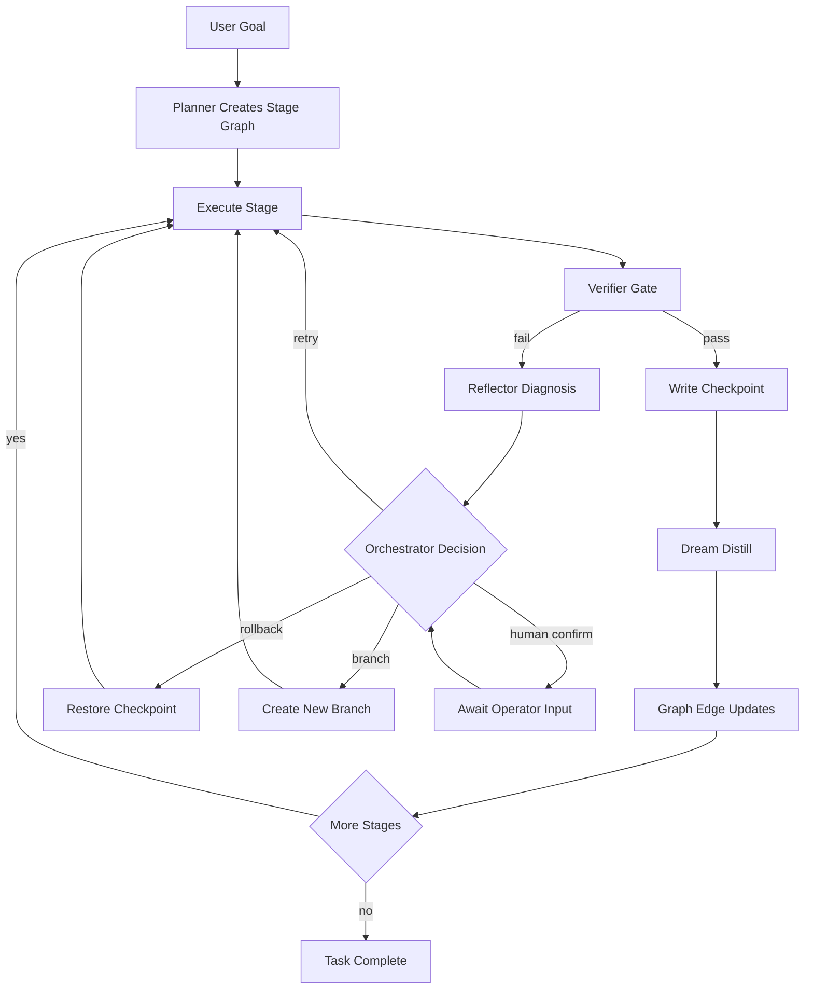

# Cognitive OS architecture

Last updated: 2026-04-12

## Product definition

OpenAEON should operate as a cognitive operating system, not only a step by
step responder.

Core requirements:

- Stage aware execution
- Full traceability of why each transition happened
- Recovery from failures with rollback and retry
- Branching from prior checkpoints without losing old paths
- Parallel task collaboration with isolated context
- Reusable experience through indexed summaries and raw evidence

## Core principles

### Dream is not memory

- Dream memory is for distillation, indexing, and scheduling signals.
- Episodic memory is the source of truth for full replay and recovery.
- Dream data must never overwrite raw evidence.

### State flow is not one way

The system must support:

- `forward`
- `rollback`
- `retry`
- `branch`
- `restore`

### Multi task execution needs orchestration

Do not overload one coordinator with shared mixed context. Each task needs:

- Isolated state machine
- Isolated memory domain
- Isolated checkpoint chain
- Shared graph and scheduling surfaces only where needed

## Six layer architecture

### Layer 1 interaction

User visible surfaces:

- Chat input and output
- Stage and execution timeline
- Rollback retry branch controls
- Dream summary card
- Trace history and search
- Task board and model tool status

### Layer 2 task state machine

Per task state record:

- `task_id`
- `goal`
- `current_stage`
- `current_checkpoint`
- `current_branch`
- `stage_history`
- `retry_count`
- `rollback_available`
- `verification_status`

Stage statuses:

- `queued`
- `planning`
- `running`
- `verifying`
- `blocked`
- `failed`
- `completed`
- `rolled_back`
- `branched`

### Layer 3 memory system

Four memory planes:

1. Working memory
2. Episodic memory
3. Dream memory
4. Graph memory

Working memory stores short lived stage context.

Episodic memory stores immutable full execution traces:

- Inputs and outputs
- Tool calls
- Intermediate decisions
- Errors and test logs

Dream memory stores compressed stage artifacts:

- Stage summary
- Key decisions
- Risk markers
- Next action
- Retrieval anchors

Graph memory stores typed entities and relations for cross step lookup and
causal explanation.

### Layer 4 checkpointing and recovery

A checkpoint is written after each critical stage boundary.

Minimum checkpoint payload:

- `task_id`
- `stage_id`
- `branch_id`
- Stage input context
- Stage outputs
- Key decisions
- Tool outcomes
- Model profile
- `dream_id`
- `previous_checkpoint_id`
- Recoverable runtime state

Checkpoint operations:

- Rollback to prior state
- Retry from same stage
- Branch from any checkpoint
- Diff across branches

### Layer 5 orchestration and agent roles

Minimal role set:

1. Planner
2. Executor
3. Verifier
4. Reflector
5. Memory Manager
6. Orchestrator

Responsibilities:

- Planner: task decomposition and dependency graph
- Executor: tool use and output production
- Verifier: pass or fail gates per stage
- Reflector: failure diagnosis and repair strategy
- Memory Manager: writes episodic memory, dream artifacts, and graph edges
- Orchestrator: global scheduling, transitions, and aggregation

### Layer 6 model routing and policy

Routing dimensions:

- Task type
- Stage type
- Agent role
- Complexity
- Risk
- Cost budget

Suggested defaults:

- Planner and Reflector: high reasoning profile
- Executor: tool friendly execution profile
- Verifier: rule first plus model assist
- Dream distillation: stable low cost summarization profile

## State transition flow



## Dream schema

```json
{
  "dream_id": "dream_stage_2_v1",
  "task_id": "task_001",
  "stage_id": "stage_2",
  "branch_id": "main",
  "summary": "Design complete and option A selected",
  "key_decisions": ["prefer lower cost toolchain", "defer high complexity branch"],
  "risks": ["end to end tests pending", "edge cases not yet covered"],
  "next_action": "enter execution stage",
  "anchors": ["decision:option_a", "risk:not_tested", "stage:design_done"],
  "source_checkpoints": ["ckpt_stage_1", "ckpt_stage_2"],
  "created_at": "2026-04-12T00:00:00Z"
}
```

## Checkpoint schema

```json
{
  "checkpoint_id": "ckpt_stage_2_v1",
  "task_id": "task_001",
  "stage_id": "stage_2",
  "branch_id": "main",
  "previous_checkpoint_id": "ckpt_stage_1_v2",
  "stage_input": {},
  "stage_output": {},
  "key_decisions": [],
  "tool_results": [],
  "model_profile": {
    "role": "executor",
    "provider": "openai",
    "model": "gpt-5.4"
  },
  "dream_id": "dream_stage_2_v1",
  "recovery_state": {},
  "created_at": "2026-04-12T00:00:00Z"
}
```

## Graph model

Required node types:

- `Task`
- `Stage`
- `Checkpoint`
- `Dream`
- `Decision`
- `Evidence`
- `ToolCall`
- `Error`
- `Retry`
- `Branch`
- `Agent`
- `ModelProfile`
- `MemoryChunk`

Required edges:

- `Task HAS_STAGE Stage`
- `Stage HAS_CHECKPOINT Checkpoint`
- `Stage GENERATES Dream`
- `Decision BASED_ON Evidence`
- `Error TRIGGERS Rollback`
- `Branch DERIVED_FROM Checkpoint`
- `Dream SUMMARIZES MemoryChunk`
- `Agent EXECUTES Stage`
- `ModelProfile APPLIED_TO Stage`

## UI layout

Main panel:

- Chat and execution timeline
- Current task and stage
- Verification result
- Dream summary

Right panel:

- Current checkpoint and branch
- Current dream and anchor links
- Recent errors
- Related history retrieval
- Model profile and tool calls

Per stage actions:

- View details
- Roll back here
- Branch here
- Retry stage
- Open stage memory
- Open stage dream

## Delivery phases

Phase 1 platform foundations:

1. Checkpoints with deterministic restore
2. Separation of dream and raw memory
3. Rollback retry branch primitives
4. Stage history tree
5. Verifier gate for every stage completion

Phase 2 collaboration loop:

1. Planner Executor Verifier role split
2. Orchestrator scheduling
3. Model routing
4. Graph memory baseline

Phase 3 differentiated capabilities:

1. Dream guided scheduling
2. Cross task dream retrieval
3. Branch outcome comparison
4. Cognitive trajectory visualization

## Gateway compatibility note

If a client returns `GatewayRequestError: unknown method: task_plan.approve`,
the running gateway process likely does not include the latest task plan
handlers.

Quick checks:

1. Confirm the source contains `task_plan.approve` in
   `src/gateway/server-methods/task-plan.ts`.
2. Confirm handlers are wired in `src/gateway/server-methods.ts` via
   `...taskPlanHandlers`.
3. Restart the actual running gateway process so the latest build is loaded.

For local operation and restart guidance, see:

- [Gateway Architecture](/concepts/architecture)
- [Gateway Troubleshooting](/gateway/troubleshooting)
- [Gateway Background Process](/gateway/background-process)

## Related docs

- [Cognitive OS Engineering Plan](/concepts/cognitive-os-engineering-plan)
- [Memory](/concepts/memory)
- [Multi-agent](/concepts/multi-agent)
