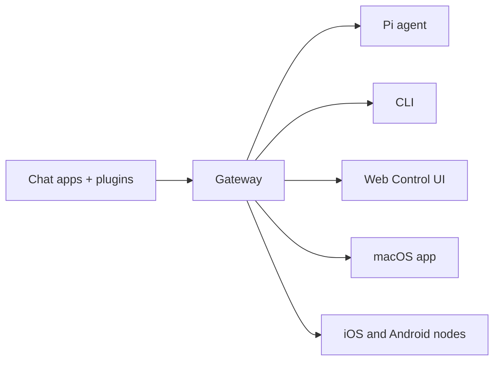

# OpenAEON 🦞

<p align="center">
    
    
</p>

> _"EXFOLIATE! EXFOLIATE!"_ — A space lobster, probably

<p align="center">
  <strong>Any OS gateway for AI agents across WhatsApp, Telegram, Discord, iMessage, and more.</strong><br />
  Send a message, get an agent response from your pocket. Plugins add Mattermost and more.
</p>

## The Fractal Cognitive Engine

OpenAEON is a **multi-channel gateway** and an **Autonomous Cognitive Engine**. It is powered by the **FCA Core (Fractal Cognitive Adapter)**, a multi-layer architecture that transforms simple AI interactions into a recursive, verifiable logic loop.

### 🧠 Core Philosophy
Instead of simple linear processing, OpenAEON decomposes complex problem spaces into verifiable sub-loops. It uses **Peano Space-Filling Traversal** to map complex tasks into high-density cognitive streams, ensuring no reasoning gaps are left behind.

### 🏗 9-Layer Architecture
The system is built on nine specialized layers of intelligence:
- **Semantic Grounding**: Mapping input to high-dimensional tokens.
- **Topology Analytics**: Understanding context proximity.
- **Fractal Decomposition**: Recursive goal splitting.
- **Decision Adjudication**: Policy and guardrail alignment.
- **Strategy Flux**: Real-time strategy auto-tuning.
- **Forensic Simulation**: Error replay and thought-trace reconstruction.

👉 **[Deep-dive into FCA Core Architecture](/aeon/FCA_CORE)**

## What is OpenAEON?

OpenAEON is a **self-hosted gateway** that connects your favorite chat apps — WhatsApp, Telegram, Discord, iMessage, and more — to AI coding agents. You run a single Gateway process on your own machine, and it becomes the bridge between your messaging apps and an always-available, self-evolving AI assistant.

**Who is it for?** Developers and power users who want a personal AI assistant they can message from anywhere — without giving up control of their data or relying on a hosted service.

## How it works



The Gateway is the single source of truth for sessions, routing, and channel connections.

## Key capabilities

<Columns>
  <Card title="Multi-channel gateway" icon="network">
    WhatsApp, Telegram, Discord, and iMessage with a single Gateway process.
  </Card>
  <Card title="Plugin channels" icon="plug">
    Add Mattermost and more with extension packages.
  </Card>
  <Card title="Multi-agent routing" icon="route">
    Isolated sessions per agent, workspace, or sender.
  </Card>
  <Card title="Media support" icon="image">
    Send and receive images, audio, and documents.
  </Card>
  <Card title="Web Control UI" icon="monitor">
    Browser dashboard for chat, config, sessions, and nodes.
  </Card>
  <Card title="Mobile nodes" icon="smartphone">
    Pair iOS and Android nodes with Canvas support.
  </Card>
</Columns>

## Quick start

<Steps>
  <Step title="Install OpenAEON">
    ```bash
    npm install -g openaeon@latest
    ```
  </Step>
  <Step title="Onboard and install the service">
    ```bash
    openaeon onboard --install-daemon
    ```
  </Step>
  <Step title="Pair WhatsApp and start the Gateway">
    ```bash
    openaeon channels login
    openaeon gateway --port 18789
    ```
  </Step>
</Steps>

Need the full install and dev setup? See [Quick start](/start/quickstart).

## Dashboard

Open the browser Control UI after the Gateway starts.

- Local default: [http://127.0.0.1:18789/](http://127.0.0.1:18789/)
- Remote access: [Web surfaces](/web) and [Tailscale](/gateway/tailscale)

<p align="center">
  
</p>

## Configuration (optional)

Config lives at `~/.openaeon/openaeon.json`.

- If you **do nothing**, OpenAEON uses the bundled Pi binary in RPC mode with per-sender sessions.
- If you want to lock it down, start with `channels.whatsapp.allowFrom` and (for groups) mention rules.

Example:

```json5
{
  channels: {
    whatsapp: {
      allowFrom: ["+15555550123"],
      groups: { "*": { requireMention: true } },
    },
  },
  messages: { groupChat: { mentionPatterns: ["@openaeon"] } },
}
```

## Start here

<Columns>
  <Card title="Docs hubs" href="/start/hubs" icon="book-open">
    All docs and guides, organized by use case.
  </Card>
  <Card title="Configuration" href="/gateway/configuration" icon="settings">
    Core Gateway settings, tokens, and provider config.
  </Card>
  <Card title="Remote access" href="/gateway/remote" icon="globe">
    SSH and tailnet access patterns.
  </Card>
  <Card title="Channels" href="/channels/telegram" icon="message-square">
    Channel-specific setup for WhatsApp, Telegram, Discord, and more.
  </Card>
  <Card title="Nodes" href="/nodes" icon="smartphone">
    iOS and Android nodes with pairing and Canvas.
  </Card>
  <Card title="Help" href="/help" icon="life-buoy">
    Common fixes and troubleshooting entry point.
  </Card>
</Columns>

## Learn more

<Columns>
  <Card title="FCA Core Architecture" href="/aeon/FCA_CORE" icon="brain">
    Fractal Cognitive Adapter: 9-layer autonomous architecture, Peano maps, and auto-tuning.
  </Card>
  <Card title="Full feature list" href="/concepts/features" icon="list">
    Complete channel, routing, and media capabilities.
  </Card>
  <Card title="Multi-agent routing" href="/concepts/multi-agent" icon="route">
    Workspace isolation and per-agent sessions.
  </Card>
  <Card title="Security" href="/gateway/security" icon="shield">
    Tokens, allowlists, and safety controls.
  </Card>
  <Card title="Troubleshooting" href="/gateway/troubleshooting" icon="wrench">
    Gateway diagnostics and common errors.
  </Card>
  <Card title="About and credits" href="/reference/credits" icon="info">
    Project origins, contributors, and license.
  </Card>
</Columns>
