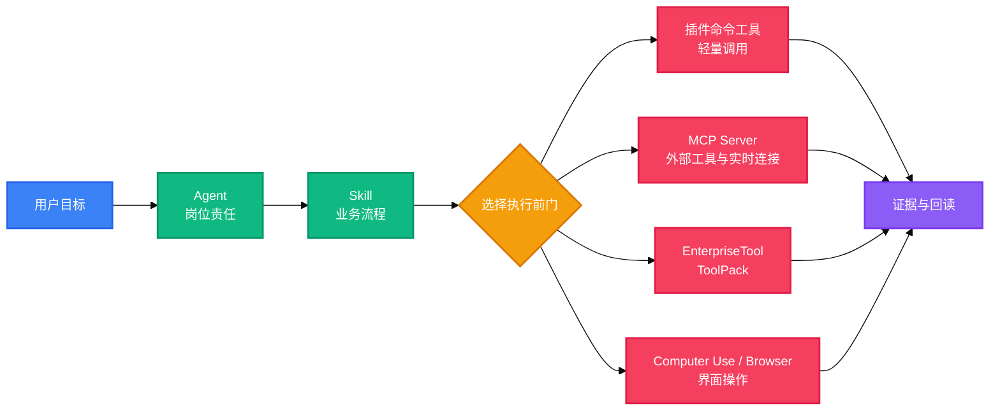

本目录说明怎样在 FCACore 中开发可发现、可授权、可执行、可审计的业务 Agent 插件。文档只描述当前模板和仓库已经实现的合同，不把规划中的能力写成已交付功能。

## 从哪里开始

<Columns cols={3}>
  <Card title="快速开始" icon="rocket" href="/zh-CN/fcacore-agent-plugins/getting-started">
    复制模板、裁剪示例并完成第一次校验。
  </Card>

  <Card title="运行架构" icon="workflow" href="/zh-CN/fcacore-agent-plugins/plugin-runtime">
    理解 Agent、Skill、Tool、ToolPack 与 Transport 的边界。
  </Card>

  <Card title="Agent 与 Skill" icon="bot" href="/zh-CN/fcacore-agent-plugins/agent-skill-manifest">
    编写双 Manifest、岗位职责和任务流程。
  </Card>

  <Card title="工具接入" icon="plug" href="/zh-CN/fcacore-agent-plugins/tool-integration">
    接入 CLI、HTTP、MCP 和外部自建接口。
  </Card>

  <Card title="实时 WebSocket" icon="radio" href="/zh-CN/fcacore-agent-plugins/realtime-websocket">
    用常驻 MCP 管理订阅、心跳、重连和事件游标。
  </Card>

  <Card title="桌面与浏览器" icon="monitor-cog" href="/zh-CN/fcacore-agent-plugins/desktop-browser">
    选择 Browser 或 Computer Use 并执行状态验证。
  </Card>

  <Card title="ToolPack" icon="package" href="/zh-CN/fcacore-agent-plugins/toolpack">
    设计企业能力合同、能力集、审批和回读。
  </Card>

  <Card title="NFE 能力参考" icon="list-tree" href="/zh-CN/fcacore-agent-plugins/nfe-capabilities">
    查询 NFE ToolPack 当前 capability 和合同完整度。
  </Card>

  <Card title="治理与发布" icon="shield-check" href="/zh-CN/fcacore-agent-plugins/governance-testing">
    检查权限、审批、证据、测试和发布门。
  </Card>
</Columns>

## 架构



## 文档边界

```text
architecture/   稳定概念、运行时发现和执行因果
guides/         插件开发者可执行步骤
integrations/   特定协议和宿主工具
toolpacks/      企业业务能力包合同
reference/      自动生成或查阅型清单
```

维护规则：

- 一个事实只保留一个权威位置，其他文档使用链接。
- `reference/nfe-capabilities.mdx` 由脚本生成，不手工修改能力行。
- 示例参数必须来自真实 Schema，不用猜测值填满字段。
- 文档中的“支持”必须能在 Manifest、代码或测试中找到对应实现。
- 新增文档后同步更新 `docs.json` 和 `scripts/validate.mjs`。

## 快速校验

在插件模板根目录运行：

```bash
npm run check
```

该命令重新生成 NFE 参考、校验目录合同并执行无外部副作用测试。

<Tip>
  在 `docs/` 目录运行 `npx mint dev` 可以启动带热更新的本地文档站。
</Tip>