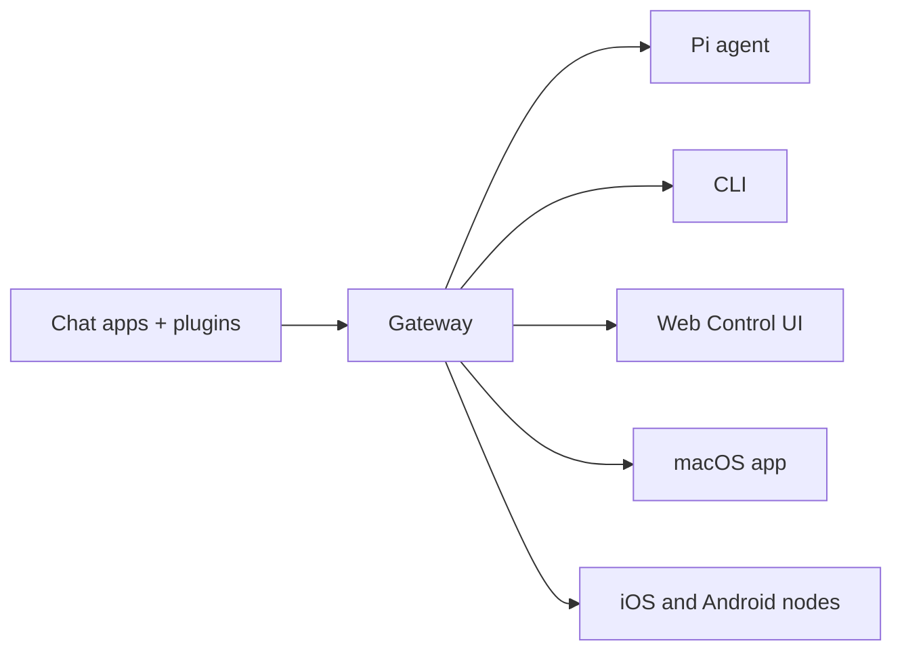

---
read_when:
  - 向新用户介绍 OpenAEON
summary: OpenAEON 是一个多渠道 AI 智能体 Gateway 网关，可在任何操作系统上运行。
title: OpenAEON
x-i18n:
  generated_at: "2026-02-04T17:53:40Z"
  model: claude-opus-4-5
  provider: pi
  source_hash: fc8babf7885ef91d526795051376d928599c4cf8aff75400138a0d7d9fa3b75f
  source_path: index.md
  workflow: 15
---

# OpenAEON 🦞

<p align="center">
    
    
</p>

> _"去壳！去壳！"_ — 大概是一只太空龙虾说的

<p align="center">
  <strong>适用于任何操作系统的 AI 智能体 Gateway 网关，支持 WhatsApp、Telegram、Discord、iMessage 等。</strong><br />
  发送消息，随时随地获取智能体响应。通过插件可添加 Mattermost 等更多渠道。
</p>

## 分形认知引擎 (Fractal Cognitive Engine)

OpenAEON 不仅仅是一个多渠道网关；它更是一个**自主认知引擎**。它由 **FCA Core (分形认知适配器)** 驱动，这是一个多层架构，将简单的 AI 交互转化为递归、可验证的逻辑闭环。

### 🧠 核心哲学
OpenAEON 不进行简单的线性对话处理，而是将复杂任务拆解为可验证的子循环。它利用 **皮亚诺空间填充遍历 (Peano Space-Filling Traversal)** 将高维度的复杂问题映射为紧凑的认知流，确保不留任何推理死角。

### 🏗 9 层架构
系统构建在九个专门的智能层级之上：
- **语义锚定 (Semantic Grounding)**：将输入映射到高维令牌。
- **拓扑分析 (Topology Analytics)**：理解上下文的语义亲近度。
- **分形分解 (Fractal Decomposition)**：递归式的目标拆解。
- **决策裁决 (Decision Adjudication)**：策略与红线对齐。
- **策略通量 (Strategy Flux)**：实时的策略与执行评估闭环调优。
- **取证仿真 (Forensic Simulation)**：错误回放与思维溯源。

👉 **[深度探索：FCA Core 架构](/aeon/FCA_CORE)**

## 什么是 OpenAEON？

OpenAEON 是一个**自托管网关**，它将你最喜欢的聊天应用（WhatsApp、Telegram、Discord、iMessage 等）连接到 AI 编程智能体。你只需在自己的机器上运行一个 Gateway 进程，它就成为了你的消息应用与一个始终在线、自我进化的 AI 助手之间的桥梁。

**它是为谁设计的？** 开发人员和高级用户，他们希望拥有一个可以随时随地发消息的个人 AI 助手，同时又不愿放弃对数据的控制，也不愿依赖托管服务。

## 工作原理



Gateway 网关是会话、路由和渠道连接的唯一事实来源。

## 核心功能

<Columns>
  <Card title="多渠道 Gateway 网关" icon="network">
    通过单个 Gateway 网关进程连接 WhatsApp、Telegram、Discord 和 iMessage。
  </Card>
  <Card title="插件渠道" icon="plug">
    通过扩展包添加 Mattermost 等更多渠道。
  </Card>
  <Card title="多智能体路由" icon="route">
    按智能体、工作区或发送者隔离会话。
  </Card>
  <Card title="媒体支持" icon="image">
    发送和接收图片、音频和文档。
  </Card>
  <Card title="Web 控制界面" icon="monitor">
    浏览器仪表板，用于聊天、配置、会话和节点管理。
  </Card>
  <Card title="移动节点" icon="smartphone">
    配对 iOS 和 Android 节点，支持 Canvas。
  </Card>
</Columns>

## 快速开始

<Steps>
  <Step title="安装 OpenAEON">
    ```bash
    npm install -g openaeon@latest
    ```
  </Step>
  <Step title="新手引导并安装服务">
    ```bash
    openaeon onboard --install-daemon
    ```
  </Step>
  <Step title="配对 WhatsApp 并启动 Gateway 网关">
    ```bash
    openaeon channels login
    openaeon gateway --port 18789
    ```
  </Step>
</Steps>

需要完整的安装和开发环境设置？请参阅[快速开始](/start/quickstart)。

## 仪表板

Gateway 网关启动后，打开浏览器控制界面。

- 本地默认地址：http://127.0.0.1:18789/
- 远程访问：[Web 界面](/web)和 [Tailscale](/gateway/tailscale)

<p align="center">
  
</p>

## 配置（可选）

配置文件位于 `~/.openaeon/openaeon.json`。

- 如果你**不做任何修改**，OpenAEON 将使用内置的 Pi 二进制文件以 RPC 模式运行，并按发送者创建独立会话。
- 如果你想要限制访问，可以从 `channels.whatsapp.allowFrom` 和（针对群组的）提及规则开始配置。

示例：

```json5
{
  channels: {
    whatsapp: {
      allowFrom: ["+15555550123"],
      groups: { "*": { requireMention: true } },
    },
  },
  messages: { groupChat: { mentionPatterns: ["@openaeon"] } },
}
```

## 从这里开始

<Columns>
  <Card title="文档中心" href="/start/hubs" icon="book-open">
    所有文档和指南，按用例分类。
  </Card>
  <Card title="配置" href="/gateway/configuration" icon="settings">
    核心 Gateway 网关设置、令牌和提供商配置。
  </Card>
  <Card title="远程访问" href="/gateway/remote" icon="globe">
    SSH 和 tailnet 访问模式。
  </Card>
  <Card title="渠道" href="/channels/telegram" icon="message-square">
    WhatsApp、Telegram、Discord 等渠道的具体设置。
  </Card>
  <Card title="节点" href="/nodes" icon="smartphone">
    iOS 和 Android 节点的配对与 Canvas 功能。
  </Card>
  <Card title="帮助" href="/help" icon="life-buoy">
    常见修复方法和故障排除入口。
  </Card>
</Columns>

## 了解更多

<Columns>
  <Card title="完整功能列表" href="/concepts/features" icon="list">
    全部渠道、路由和媒体功能。
  </Card>
  <Card title="多智能体路由" href="/concepts/multi-agent" icon="route">
    工作区隔离和按智能体的会话管理。
  </Card>
  <Card title="安全" href="/gateway/security" icon="shield">
    令牌、白名单和安全控制。
  </Card>
  <Card title="故障排除" href="/gateway/troubleshooting" icon="wrench">
    Gateway 网关诊断和常见错误。
  </Card>
  <Card title="关于与致谢" href="/reference/credits" icon="info">
    项目起源、贡献者和许可证。
  </Card>
</Columns>
